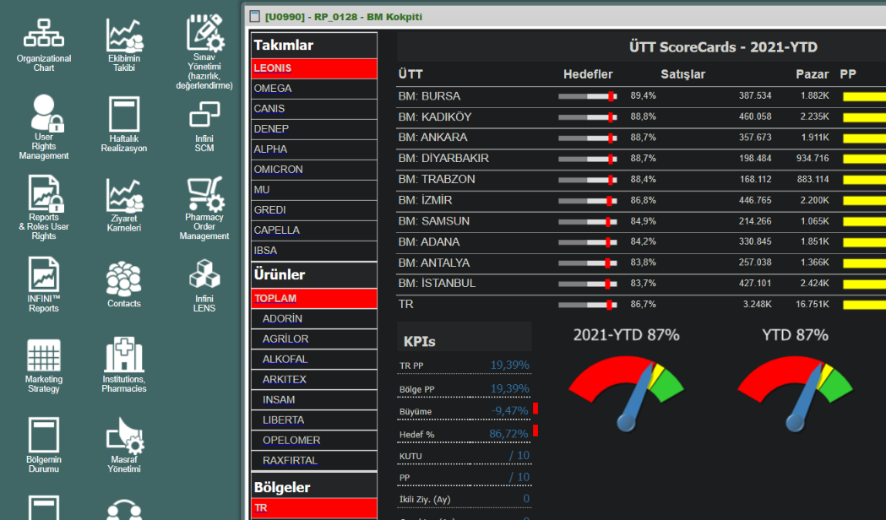
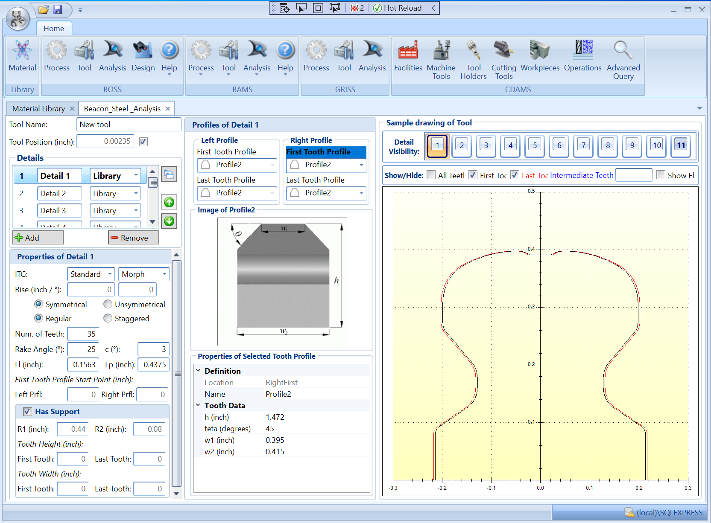
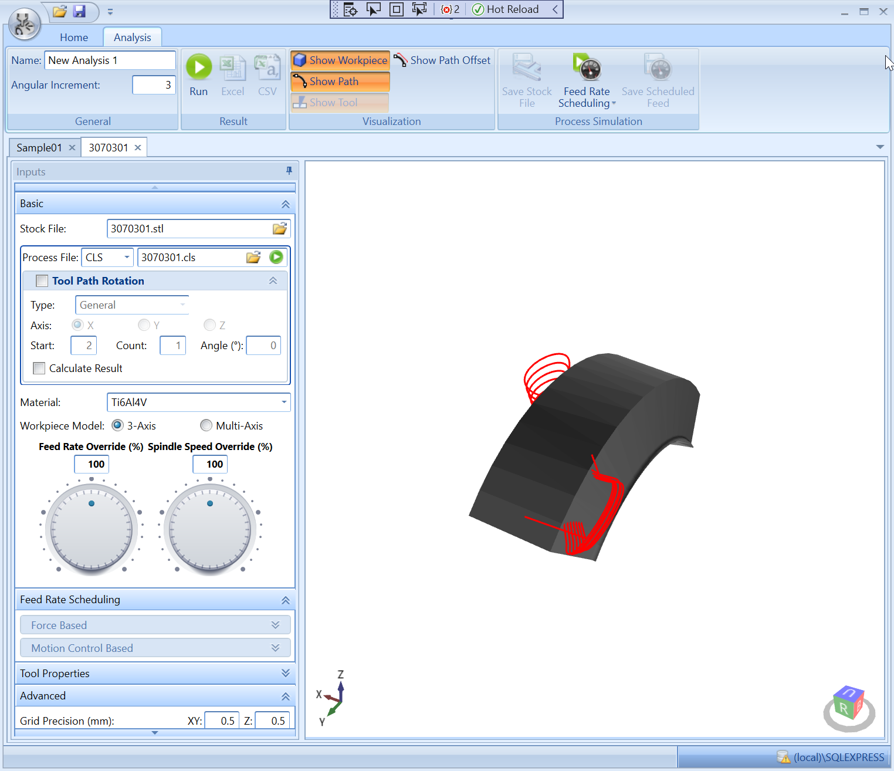
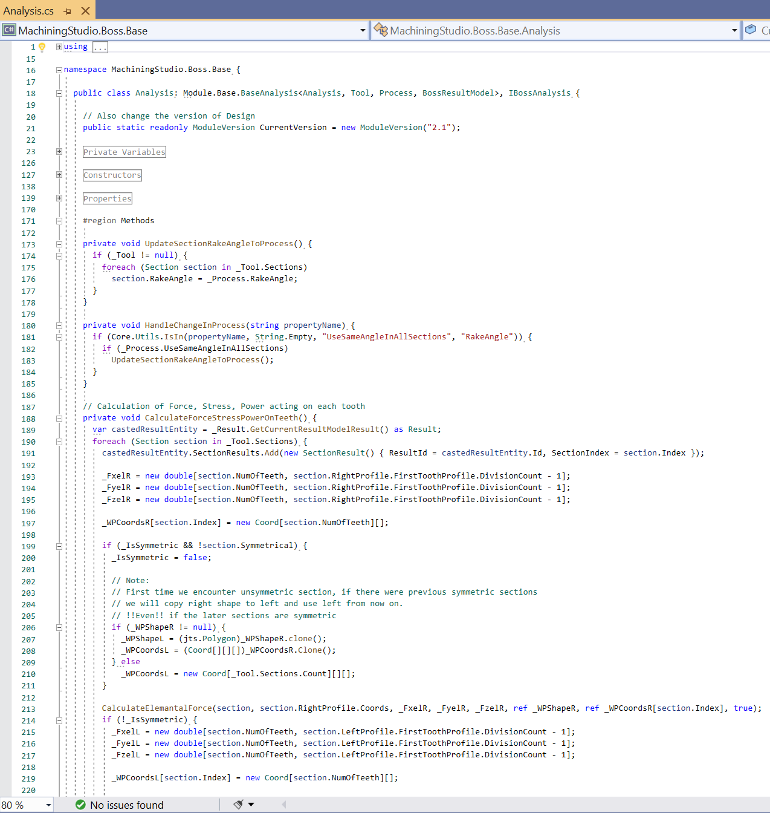
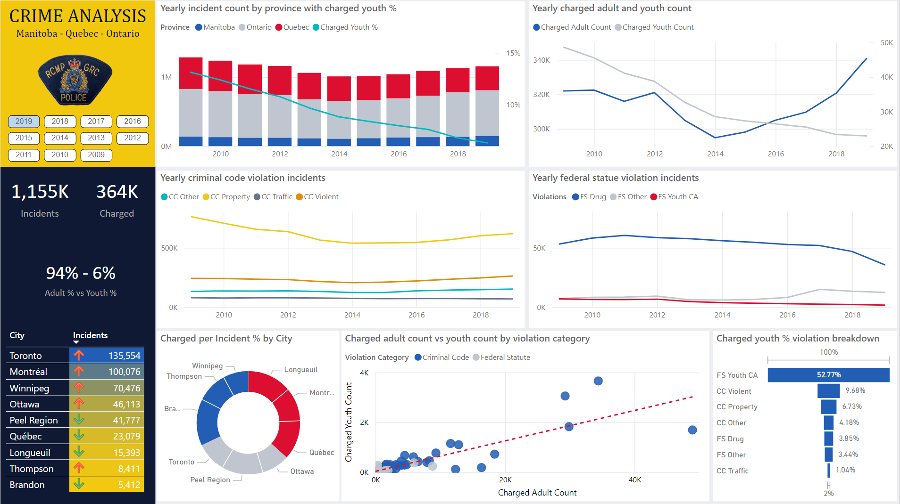
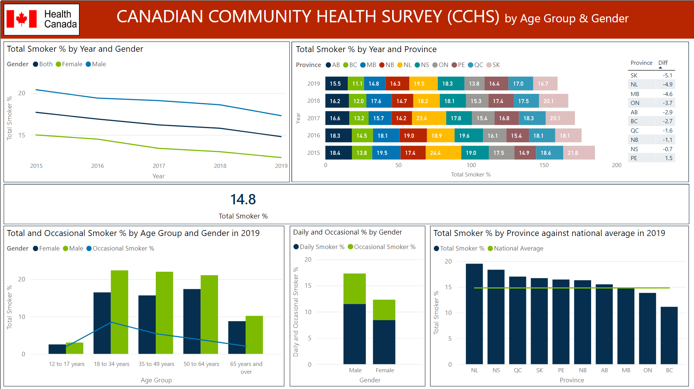
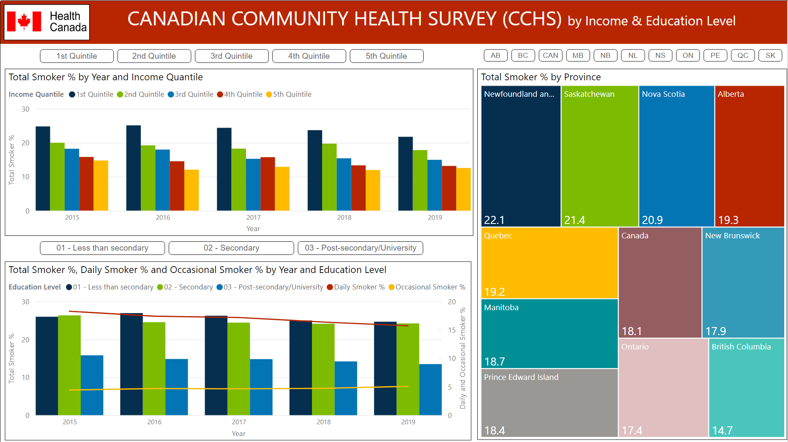

I am a full-stack developer and have worked as an "analyst" programmer for the last 20 years—with the "analyst" part, I do real problem-solving.  I have always liked solving problems, and programming became my favorite tool that brought my solutions to life.

# Programming Experience

## Infini CRM & Infini SCM
Web based CRM application tailored for pharma companies.

### *Technologies used* ###
* Microsoft SQL Server Database Engine
* Microsoft SQL Server Analysis Services
* Microsoft SQL Server Reporting Services
* .NET Framework 4.8
* ASP.NET MVC 5.2.7
* JavaScript
* Ext.JS 3.4

```SQL
; with
Store(Date, IsWorkDay, RespUnitId, OwnerCardId,
  PlannedVisitCount, RealizedVisitCount, RealizedVisitCountDr,
  RealizedVisitCountPh, VisitCount, VisitCountDr, VisitCountPh,
  ActivityCount, PlannedRealizedVisitCount)
as
(
  select cd.Date, cd.IsWorkDay, mi.RespUnitId, min(mi.CardId) as OwnerCardId,
    sum(case when ap.IsVisitType = 1 and ap.IsPlanned = 1 then 1 else 0 end),
    sum(case when ap.IsVisitType = 1 and ap.IsRealized = 1 then 1 else 0 end),
    sum(case when ap.IsVisitType = 1 and ap.IsRealized = 1 and c.CardTypeId = @CardType_Doctor then 1 else 0 end),
    sum(case when ap.IsVisitType = 1 and ap.IsRealized = 1 and c.CardTypeId <> @CardType_Doctor then 1 else 0 end),
    sum(case when ap.IsVisitType = 1 then 1 else 0 end),
    sum(case when ap.IsVisitType = 1 and c.CardTypeId = @CardType_Doctor then 1 else 0 end),
    sum(case when ap.IsVisitType = 1 and c.CardTypeId <> @CardType_Doctor then 1 else 0 end),
    sum(case when ap.IsVisitType = 0 and ap.IsRealized = 1 then 1 else 0 end),
    sum(case when ap.IsVisitType = 1 and ap.IsPlanned = 1 and ap.IsRealized = 1 then 1 else 0 end)
  from
    @MsrInfo mi
    cross join (select Date, IsWorkDay from dbo.CalendarDate where Date between @SelectedPeriod and @EndDate) as cd
    left join dbo.ActivityPlan ap on ap.Date = cd.Date and ap.OwnerCardId = mi.CardId and ap.Id = ap.RefId
    left join dbo.Card c on c.Id = ap.CardId
  group by cd.Date, cd.IsWorkDay, mi.RespUnitId
),
YtdVisit(OwnerCardId, PlannedVisitCountYtd, PlannedVisitCountYtdDr,
  PlannedVisitCountYtdPh, RealizedVisitCountYtd, RealizedVisitCountYtdDr,
  RealizedVisitCountYtdPh, PlannedRealizedVisitCountYtd)
as
(
  select
    ap.OwnerCardId,
    sum(case when ap.IsPlanned = 1 then 1 else 0 end),
    sum(case when ap.IsPlanned = 1 and c.CardTypeId = @CardType_Doctor then 1 else 0 end),
    sum(case when ap.IsPlanned = 1 and c.CardTypeId <> @CardType_Doctor then 1 else 0 end),
...
```



## Machining Studio
A simulation application tailored for machine tooling (CNC) operations.
### *Technologies used* ###
* SQL Express
* .NET Framework 4.0
* WPF (Windows Presentation Foundation)
* MEF (Managed Extensibility Framework)







## MedIX
A custom application for MedIX (Hospital Information System application), that can work like a mediator between any laboratory machine (communicating with them through RS232 port) and MedIX in order to send MedIX laboratory orders to machines and then to get results from machines to MedIX.
### *Technologies used* ###
* .NET
* Oracle DB
* Windows Services

## Cerebrum ERP & CDS Data Analysis Tool
Client/Server architecture ERP application with a included cost accounting, integrated manufacturing modules.
### *Technologies used* ###
* Microsoft SQL Server
* Microsoft SQL Analysis Services / OLAP
* Object Pascal
* Delphi


# Data Analysis

And programming goes hand to hand with data. After working on a huge and variety of applications, I wanted to play with the data and unearth hidden things. Of course, back then, there were no modern AI, data science, machine learning technologies, or services to speak of. I created OLAP cubes, wrote mind-boggling MDX queries, and waited patiently for our local servers to generate the result. Then, the cloud only meant the thing in the sky, and when an algorithm is mentioned, it only meant another quick sorting logic :)

I have begun my journey to formal data science around 2019 with Microsoft Professional Data Science Certificate Program. However, since I did not switch careers from programming to data engineer, I continued to improve my data science knowledge by taking other online programs, and I learned a lot :)

Here are some of the projects and files that are the outputs of my education:

### A descriptive analysis with Jupyter Notebook: [Green Energy Analysis](data_science/jupyter/green_energy/Green Energy Analysis.html)

## Visual Analyses using Power BI
### 1. Manitoba-Quebec-Ontario Crime Analysis, 2009-2019
<br/>

### 2. [Canadian Community Health Survey - Smoking Analysis, 2015-2019]
<br/>

<br/>

